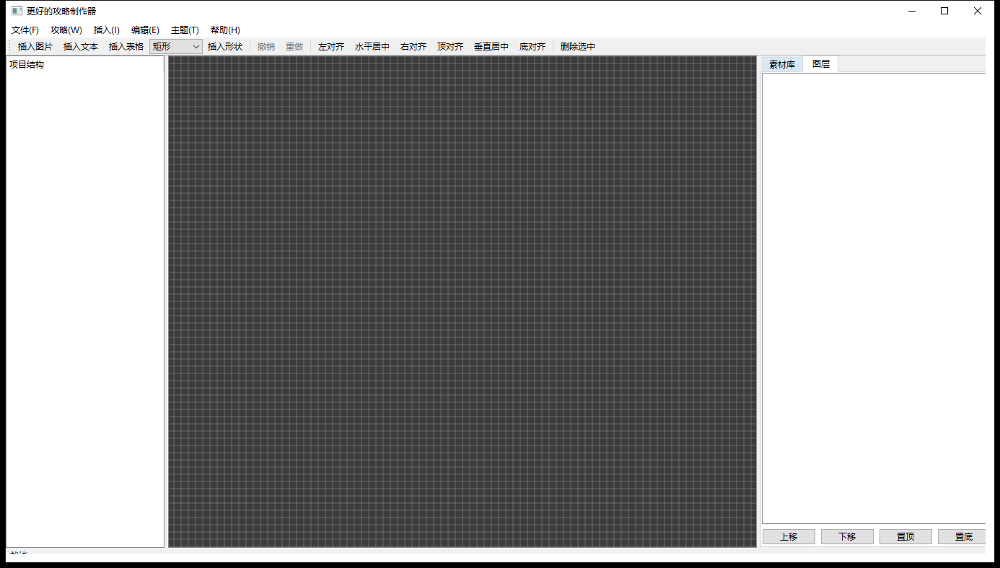

# Better-Walkthrough-Maker

**更好的攻略制作器** —— 面向游戏攻略作者的桌面设计工具：用"模板 + 自由画布"的方式制作攻略配图（装备推荐、属性对比、剧情流程等），导出 PNG 发布到小黑盒等平台。

## 功能特性

- **项目管理**：项目 → 攻略 → 页面 三层结构；每页独立画布尺寸；自动保存 + 崩溃恢复；最近项目
- **画布编辑器**：图片/文本/表格/形状/贴纸 五类组件；拖拽/缩放/旋转、多选联动、图层管理、对齐与等距分布、网格与边缘吸附、撤销重做、跨页面复制
- **素材库**：批量导入图片（复制进项目自包含），缩略图预览，双击插入画布
- **模板系统**：六类内置模板（装备推荐/属性对比/剧情流程/武器评测/地图点位/通用封面）+ 空白模板；用户模板保存/导入/导出（.json）
- **美化包**：贴纸装饰（标题装饰线/角标/星标/箭头/分割线/卡片边框）+ 主题包（深色游戏风/浅色简洁风，影响画布与导出背景）
- **导出**：单页/批量/长图 PNG（1x/2x/3x），可选作者署名，一键打开导出目录；复制当前页到剪贴板直贴小黑盒

## 截图

> 占位：以下截图待补充（在 `docs/screenshots/` 下放入后即显示）。

| 主界面 | 画布编辑 | 模板选择 | 导出对话框 |
|---|---|---|---|
|  |  |  |  |

## 下载与发布

[](https://github.com/ChthollyFan/Better-Walkthrough-Maker/releases)

- **绿色版 zip**：从 [Releases](https://github.com/ChthollyFan/Better-Walkthrough-Maker/releases) 下载，解压后直接运行 `BetterWalkthroughMaker.exe`（无需安装 Qt）
- **本地打包**：`powershell -ExecutionPolicy Bypass -File .\deploy.ps1`（生成 `dist/` 下绿色版 zip）
- **自动发布**：打标签 `git tag v0.1.0 && git push origin v0.1.0`，GitHub Actions 自动构建（装 Qt → 编译 → 测试 → 打包）并发布到 Releases

## 文档

- [项目规划](docs/project-plan.md) — 产品定位、数据模型、功能模块、技术架构、里程碑与实现记录
- [C++ 编码规范](docs/c++编码规范.md) — 代码风格与命名约定（开发前请阅读）

## 许可证

[MIT](LICENSE) © 2026 ChthollyFan

## 构建与测试

依赖：CMake ≥ 3.21、Ninja、MinGW-w64 g++（14.x）、Qt 6（MinGW 版，如 6.11.2）。

```powershell
# 配置（显式指定 MinGW 版 Qt 路径；若环境变量 Qt6_DIR 指向其他版本需覆盖）
cmake -S . -B build -G Ninja "-DCMAKE_PREFIX_PATH=C:/Users/ThinkPad/Qt/6.11.2/mingw_64" "-DQt6_DIR=C:/Users/ThinkPad/Qt/6.11.2/mingw_64/lib/cmake/Qt6" -DCMAKE_BUILD_TYPE=Release -DCMAKE_CXX_COMPILER=g++

# 编译
cmake --build build

# 运行测试（4 个测试程序）
$env:PATH = "C:/Users/ThinkPad/Qt/6.11.2/mingw_64/bin;" + $env:PATH
ctest --test-dir build --output-on-failure

# 运行主程序（首次构建后需 windeployqt 部署运行时 DLL 到 exe 目录）
windeployqt --release --compiler-runtime build\src\bwm.exe
build\src\bwm.exe
```

## 当前状态

- ✅ 规划定稿（`docs/project-plan.md`）
- ✅ **M1–M6 全部完成**（骨架 / 画布 / 表格与素材库 / 导出 / 模板与美化包 / 打磨）
- ✅ 单元测试 4 个测试程序全部通过（序列化 / 项目管理 / 导出渲染 / 模板）
- ⏳ 后续：小黑盒图片规格实测、安装包发布、GIF 导出、蒙版/滤镜、模板占位符
